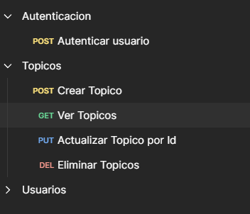
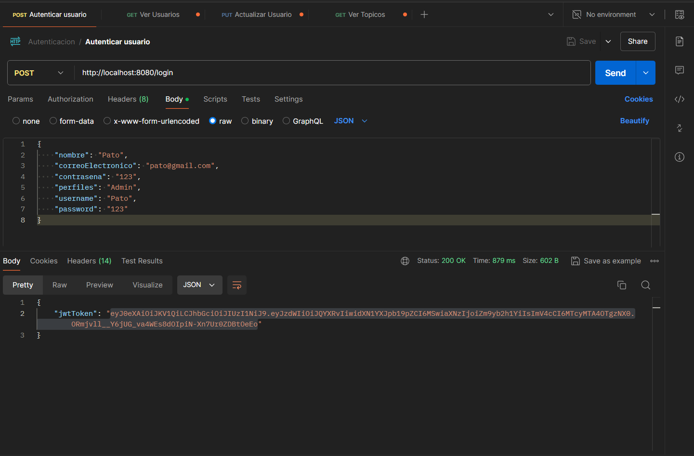
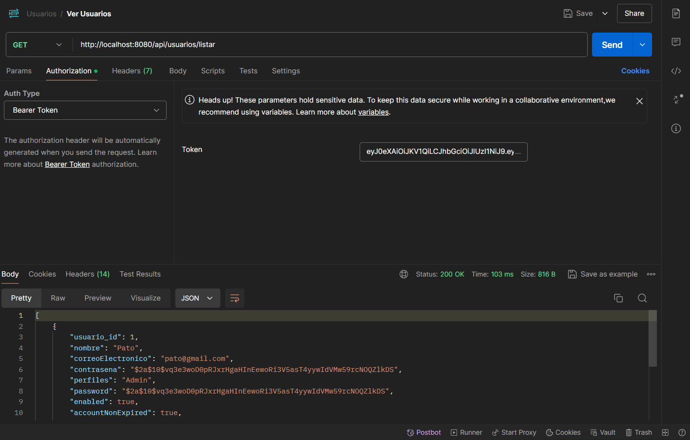

# Alura-Challenge-RESTAPI-ForoHub

¡Hola! Este Challenge es para completar el curso de Practicando Spring Framework: Challenge Foro Hub. 
Explicare un poco de su uso.

## Acerca del Challenge 🔎
En este Challenge se crea una REST API con diferentes endpoints que pueden crear, enlistar, modificar y borrar topicos de un foro. 
Esta REST API esta conectada a una base de datos de MySQL y para poder acceder a ella primero hay que autenticarse con un metodo POST.
## Pre-requisitos 🔧
Tener instalado MySQL y realizar los cambios correspondientes en el archivo *application.properties* para realizar la conexion a tu base de datos inicializada en tu localhost.
## Galeria 📷

Metodos de la API en Postman

Autenticacion de un usuario ya creado.

Es necesario colocar el token proporcionado al autenticar un usuario para poder acceder a los demas endpoints.

## Autor ✒
[Patricio Garcia](https://github.com/Patricio-GarciaRs) ✌🏼